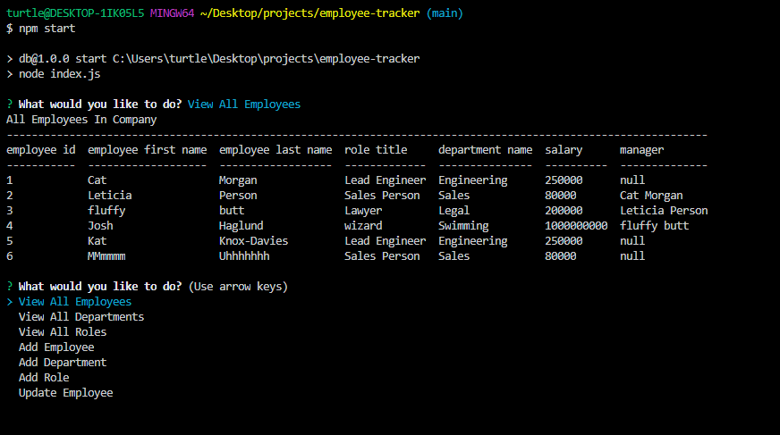

___

# SQL: Employee Tracker

## Description

This was a project to write a **content management system** using Node.js and MySQL.

I used three Node Package Modules: [MySQL2](https://www.npmjs.com/package/mysql2), [Inquirer](https://www.npmjs.com/package/inquirer), and [console.table package](https://www.npmjs.com/package/console.table).

**Extra:** After you run thru the question prompts for adding an employee, role, or department, it gives you a table to see the new entry in the database. 

I also added validation to my inquirer prompts so the user would either have to put at least something, or input a number where required.

**Regrets:** This week was hectic. I would like to try the bonus eventually, when I have more free time.


## Table of Contents 

* [License](#license)
* [Installation](#installation)
* [Usage](#usage)
* [Credits](#credits)


## License

[](https://opensource.org/licenses/GPL-2.0)

## Installation 

First star it. 
Then you could either fork it or download a zip file of it.

You should also have Node and MySQL installed to your machine.

Then hit ```npm i``` to install all of the packages included in the package.json file.

## Usage

**I added shortcut commands for npm:**

```npm run schema``` to set up your tables.

```npm run seed``` to set up some starter data for your base.

Then replace with your own root passcode in the db/connection.js

Once you booted up MuSQL and ran the above commands, you're going to want to use ```use employees;``` and then ```show tables```. I'd recommend using two side by side terminals in your VS Code or b
editor of choice.

```npm start``` will run the application.


## Credits

My friend **Josh Haglund** helped me understand the MySQL syntax a bit better, my cohort's TA, **Leticia** assisted me in getting my TABLES up amnd running, and my tutor, **Ben Abbot**, helped me get my files and psuedocode all set up.


## How You Can Contribute

If you find issues open up an issues on the original repo! Fix it or add to it, then make a pull request.

## How You Can Reach Me

If you'd like to ask further questions you can reach me via [GitHub](https://github.com/cat-lin-morgan/) or email me at plummorgan@gmail.com!

## Screenshot and Video Walk-Thru

### Video Walk-thru
[Click here for the walk-thru of my application.](https://drive.google.com/file/d/1BkFU57Tyg-q52OQlS7ih4fY66eg8qRL5/view)

### Screenshot




___Thank you___

___

